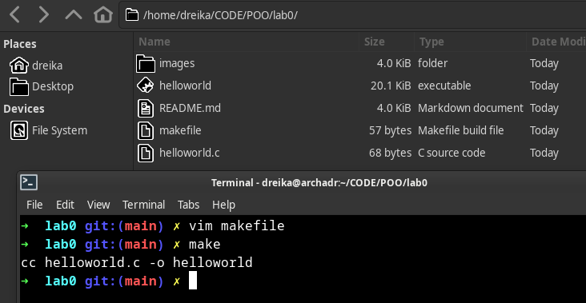

# POO Lab.0
## Păgânu Andrei, FAF-212

A short explanation of how I installed Arch on my machine.

Screenshots of the process of the flashing of the ISO image to my flash does not exist.
Rebooted my PC, entered UEFI mode, put the flash drive as the first in the boot order.

* Initial screen
 
Console shown, ready to operate.

---

* Turning on WIFI

Software lock on WIFI adapter lifted by editing the `rfkill list`.

---
* Syncing time

---
* Connecting to wifi

`iwctl` used to connect to wifi.

---
* Partitioning disk

Created two partitions out of the free space.

---
* Building the file system.

I attempted to use `pacstrap` without setting the mountpoints.
I then corrected the mistake.

---
* Using pacstrap to make the new system installation.

---
* Generaating `fstab` file

---
* Setting zone, installing Vim

---
* Editing locale file.

---
* `hostname` file was edited

---
* Editing hosts file

---
* Adding password to root, new user created, password for user.

User was added to groups, for privileges.

---
* `sudoers` file was edited

So that the user being in the wheel group matters.

---
* Installing Network Manager

So that I have access to the internet after booting into the system.
It was later enabled with `systemctl enable NetworkManager`

---
* Installing tools to set up the dual boot

Refind is a boot manager.
Installing refind

A config file had to be edited to put in the path to the partition where Linux is installed.

---
* After this, /mnt was unmounted, system reboot.

---
* Refind boot manager

---
* CLI log in screen.

---
* Video driver installation

---
* Installing xorg

Xorg is an interface between graphical software and hardware.

---
* Installing LightDM

LightDM is a desktop manager. It was installed through pacman and then enabled.
A greeter was also installed.

---
* Desktop environment xfce4 installed.

---
* Login screen and desktop

---
`git` was installed with `sudo pacman -S git` along with other developement tools.

---
* A directory for labs was created.

Git was initalised in this directory.

---
* Basic git configuration.

Files added to git.

---
* Files were commited

---
* At some point, the command `git remote add origin` was run.

---
* Files were pushed.

---
* Making the `makefile` in the directory with the `.c` file.

---
* Writing the makefile.

---
* Makefile made

---
* Running the makefile

---
* Running the executable

---